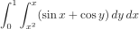

# mc-integrate

`mc-integrate` provides a small Python script for n-dimensional Monte Carlo integration. It is based on an improved version of the simple stochastic integration function I wrote for, of all things, my high school English class. You can see the original post [here](https://blog.ericzheng.org/_posts/2019-01-22-monte-carlo-integration/).

## Usage
Suppose we want to evaluate the double integral:

<p align="center"></p>

Using `mc-integrate`:

``` python
>>> import mc_integrate as mc
>>> import numpy as np
>>> bounds = [(0,1), (lambda x: x*x, lambda x: x)]
>>> mc.mc_integrate_nd(lambda x,y: np.sin(x) + np.sin(y), bounds, n=50000)
0.2278408630640774
```

Compare this to Mathematica:

``` mathematica
In[1]:= N[Integrate[Sin[x] + Cos[y], {x, 0, 1}, {y, x^2, x}]]
Out[1]:= 0.227354
```

That's not *too* bad. I'll try to improve it.

